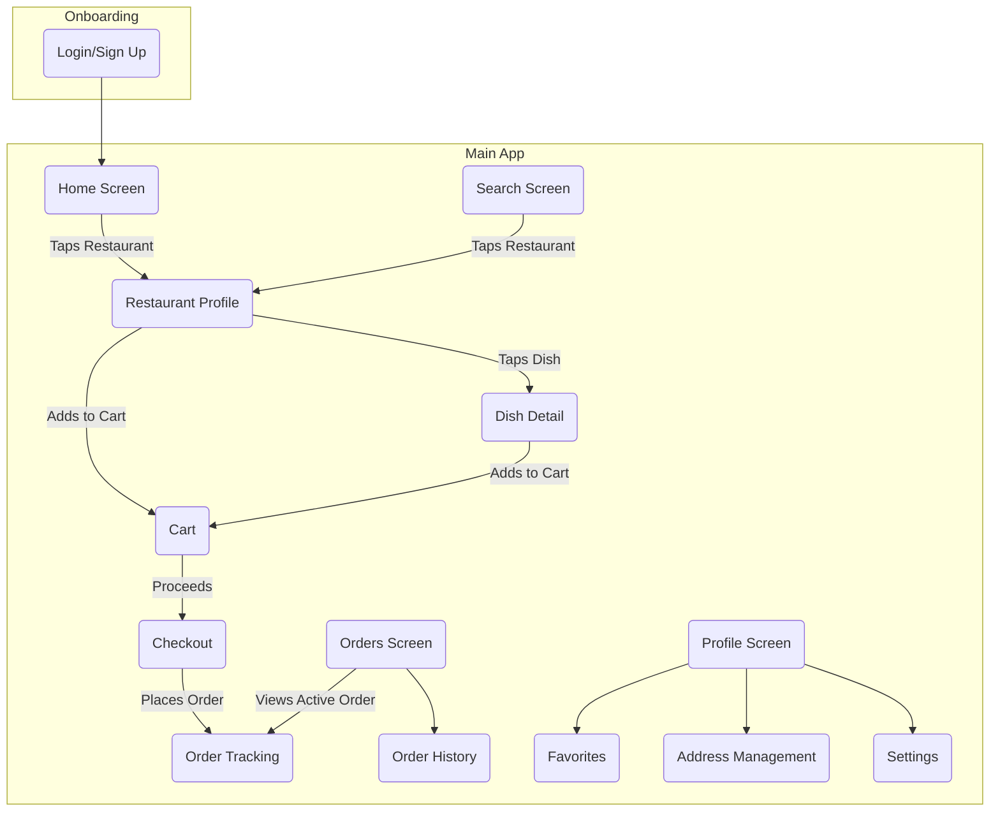
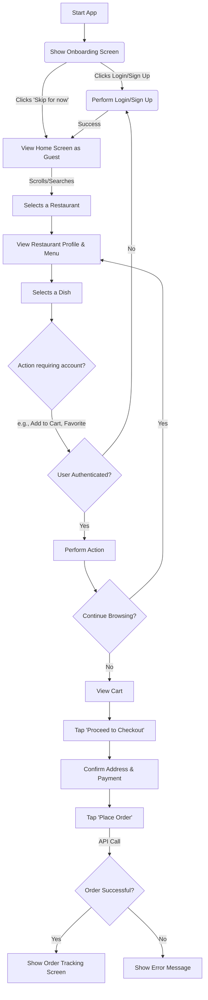
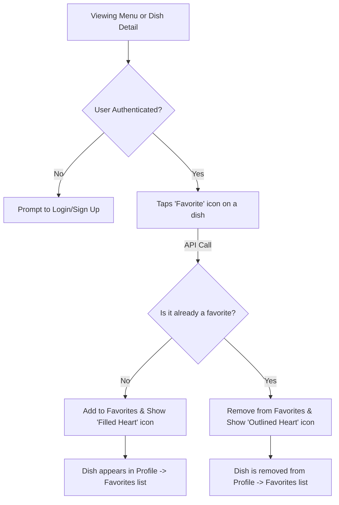
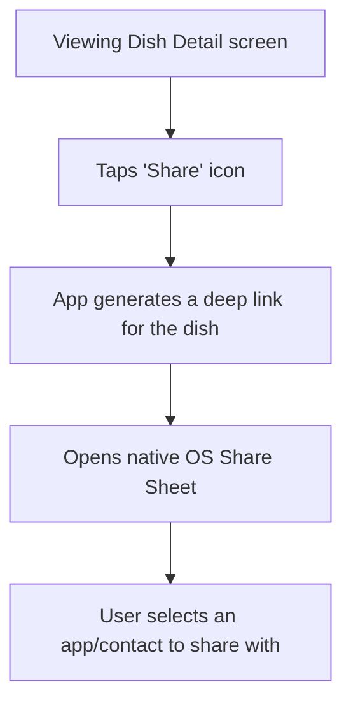

# Otlob UI/UX Specification

### **Section 1: Introduction**

This document defines the user experience goals, information architecture, user flows, and visual design specifications for Otlob's user interface. It serves as the foundation for visual design and frontend development, ensuring a cohesive and user-centered experience.

#### **Overall UX Goals & Principles**

**Target User Personas**
The primary persona for Otlob is **"Sara, the Urban Explorer"**: A 28-year-old, tech-savvy professional in Cairo who values authenticity, is tired of generic food apps, and seeks a trustworthy guide to discover local culinary gems.

**Usability Goals**
*   **Effortless Onboarding:** A new user can sign up and start discovering restaurants in under 2 minutes.
*   **Frictionless Ordering:** A returning user can find a favorite dish and place an order in under 60 seconds.
*   **Joyful Discovery:** The user feels a sense of delight and surprise when using features like 'Surprise Me!' and the curated carousels.

**Core Design Principles**
1.  **Visually Appetizing:** The UI must celebrate the food itself. High-quality imagery and clean design are paramount.
2.  **Effortless & Intuitive:** Prioritize clarity and simplicity. The best interface is one the user doesn't have to think about.
3.  **Trust Through Transparency:** Build user confidence with clear information, an honest review system, and professional presentation (like styled receipts).
4.  **Delight in the Details:** Small, thoughtful animations and micro-interactions should make the app feel alive and special.

#### **Change Log**

| Date | Version | Description | Author |
| :--- | :--- | :--- | :--- |
| 26 Sep 2025 | 1.0 | Initial draft of UI/UX Specification based on approved PRD. | Sally, UX Expert |

---
### **Section 2: Information Architecture (IA)**

#### **Site Map / Screen Inventory**
This diagram illustrates the primary screens of the application and their relationships.

#### **Navigation Structure**
*   **Primary Navigation:** The main navigation will be a bottom tab bar, providing persistent access to the app's core sections. The proposed tabs are:
    *   **Home:** The main discovery screen.
    *   **Search:** A dedicated screen for searching.
    *   **Orders:** To view active and past orders.
    *   **Profile:** For account settings, favorites, and addresses.
*   **Secondary Navigation:** Navigation to deeper screens (like a specific restaurant) will be contextual, initiated by tapping on content. Every secondary screen will feature a clear "Back" button in the header to return to the previous screen.
*   **Breadcrumb Strategy:** Traditional breadcrumbs are not suitable for this mobile interface. Context will be maintained through clear screen titles and the hierarchical back-stack navigation.

---
### **Section 3: User Flows**

#### **Flow 1: Order Placement (with Guest Mode)**

**User Goal:** To discover a restaurant, choose a meal, and successfully place an order for delivery.

**Entry Points:** App launch.

**Success Criteria:** A guest user can browse content freely. A registered user successfully places an order and is shown the order tracking screen.

**Flow Diagram**

#### **Flow 2: Favoriting a Dish**

**User Goal:** To save a specific dish for later so I can easily find it again.

**Entry Points:** Restaurant Menu screen, Dish Detail screen.

**Success Criteria:** The dish is added to the user's "Favorites" list, and the UI provides clear visual feedback.

**Flow Diagram**

#### **Flow 3: Sharing a Dish**

**User Goal:** To share a link to a specific dish with a friend to recommend it.

**Entry Points:** Dish Detail screen.

**Success Criteria:** The native share dialog opens with a deep link to the dish.

**Flow Diagram**

---
### **Section 4: Wireframes & Mockups**

#### **Primary Design Files**
*   **Design Tool:** To be determined. A tool like Figma or Adobe XD is recommended for creating high-fidelity mockups and prototypes. For now, this document will serve as the low-fidelity wireframe specification.

#### **Key Screen Layouts**

**Screen: Home Screen**
*   **Purpose:** To allow users to discover restaurants immediately upon opening the app.
*   **Key Elements:** App Bar with location selector & 'Surprise Me!' button, Search Bar, Curated Carousels, Main Restaurant List, Bottom Tab Bar.

**Screen: Restaurant Profile**
*   **Purpose:** To provide detailed information about a restaurant and allow users to browse its menu.
*   **Key Elements:** Header Image, Info Block (name, rating, 'Tawseya' button), Menu/Reviews Tabs, Menu View (grouped by category), Reviews View.

**Screen: Shopping Cart**
*   **Purpose:** To allow users to review their order before payment.
*   **Key Elements:** List of order items with quantity controls, Special Instructions field, Price Summary (Subtotal, Fees, Total), prominent Checkout Button.

---
### **Section 5: Component Library / Design System**

#### **Design System Approach**
**Customized Material Design System:** We will leverage Flutter's built-in Material Design library as a foundation and apply a custom theme (colors, typography, shapes) to create a unique brand identity for Otlob, balancing development speed with brand consistency.

#### **Core Components**
*   **Restaurant Card:** For displaying restaurant summaries in lists and carousels.
*   **Primary Button:** For all primary calls to action.
*   **Bottom Navigation Bar:** For persistent, top-level navigation.
*   **Location-Aware App Bar:** The primary top-level navigation bar.

---
### **Section 6: Branding & Style Guide**

#### **Visual Identity**
This section proposes a foundational style guide to evoke a **premium, authentic, and modern Egyptian** feel.

#### **Color Palette**
| Color Type | Hex Code (Example) | Usage |
| :--- | :--- | :--- |
| Primary | `#0D1B2A` (Dark Navy) | App bars, primary text |
| Secondary | `#E07A5F` (Terracotta) | Primary buttons, active states |
| Accent | `#F4D06F` (Warm Gold) | 'Tawseya' icon, special badges |
| Neutrals | `#F8F9FA`, `#E9ECEF`, `#6C757D` | Backgrounds, borders, secondary text |

#### **Typography**
*   **Primary Font (Headings):** Poppins
*   **Secondary Font (Body):** Roboto

#### **Iconography**
*   **Icon Library:** Start with the default Material Design Icons.

#### **Spacing & Layout**
*   **Grid System:** Adhere to a standard 8-point grid system.

---
### **Section 7: Accessibility Requirements**

#### **Compliance Target**
*   **Standard:** WCAG 2.1 at Level AA.

#### **Key Requirements**
*   **Visual:** Ensure high color contrast (4.5:1), resizable text, and visible focus indicators.
*   **Interaction:** Ensure full screen reader support (TalkBack/VoiceOver) and large touch targets (min 44x44 pixels).
*   **Content:** Provide alternative text for all meaningful images and clear labels for all form fields.

---
### **Section 8: Responsiveness Strategy**

#### **Layout & Orientation**
*   **Primary Target:** Standard smartphone in portrait orientation.
*   **Orientation Lock:** The application will be locked to portrait mode for V1.0.
*   **Tablet Layout:** The mobile layout will be centered with appropriate margins on tablets.

---
### **Section 9: Animation & Micro-interactions**

#### **Motion Principles**
Animation will be purposeful, responsive, and consistent to enhance the user experience without being distracting.

#### **Key Animations**
*   **Screen Transitions:** Subtle fades or slides.
*   **Button & Card Presses:** Subtle scale/opacity changes for tactile feedback.
*   **Add to Cart:** A delightful animation of the item moving towards the cart icon.
*   **'Tawseya' Vote:** A special, celebratory animation to make the moment feel significant.
*   **Loading States:** Use shimmering "skeleton" loaders instead of generic spinners.

---
### **Section 10: Performance Considerations**

#### **Performance Goals**
*   **App Startup:** < 3 seconds.
*   **Screen Load:** < 2 seconds on a standard 4G connection.
*   **Interaction Response:** < 100ms.
*   **Animation FPS:** A consistent 60 fps.

#### **Design & Development Strategies**
Employ image optimization, lazy loading, skeleton loaders, and efficient API payloads to achieve performance goals.

---
### **Section 11: Next Steps**

#### **Immediate Actions**
1.  Finalize this UI/UX Specification.
2.  Begin creating high-fidelity visual mockups in a tool like Figma.
3.  Handoff this document and the PRD to the Architect.

#### **Design Handoff Checklist**
*   [x] All user flows documented
*   [x] Component inventory complete
*   [x] Accessibility requirements defined
*   [x] Responsive strategy clear
*   [x] Brand guidelines incorporated
*   [x] Performance goals established
